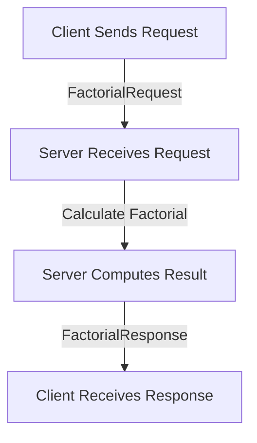

# Factorial gRPC Service

This project demonstrates a gRPC-based application for calculating the factorial of a number. It consists of a gRPC server and client implemented in Node.js using `@grpc/grpc-js` and `@grpc/proto-loader`.

## Workflow

### 1. Service Definition (`factorial.proto`)
The `factorial.proto` file defines the gRPC service, request, and response messages.

```proto
syntax = "proto3";

package factorial;

// The factorial service definition
service FactorialService {
  // Calculate factorial of a number
  rpc CalculateFactorial (FactorialRequest) returns (FactorialResponse);
}

// The request message containing the number
message FactorialRequest {
  int32 number = 1;
}

// The response message containing the result
message FactorialResponse {
  int64 result = 1;
}
```

- **Service**: `FactorialService` with one RPC method `CalculateFactorial`.
- **Request**: `FactorialRequest` contains an integer `number`.
- **Response**: `FactorialResponse` contains an integer `result` (factorial of the input number).

---

### 2. Server Implementation (`server.js`)
The server:
1. Loads the `factorial.proto` file.
2. Implements the `calculateFactorial` function to recursively compute factorials.
3. Starts a gRPC server that listens on port `50051`.

#### Key Highlights:
- Handles errors such as invalid input arguments.
- Uses `@grpc/grpc-js` for creating the gRPC server.

#### Code Snippet:
```javascript
import { loadPackageDefinition, Server, status, ServerCredentials } from '@grpc/grpc-js';
import { loadSync } from '@grpc/proto-loader';

// Load proto file
const PROTO_PATH = 'factorial.proto';
const packageDefinition = loadSync(PROTO_PATH);
const protoDescriptor = loadPackageDefinition(packageDefinition);
const factorial = protoDescriptor.factorial;

// Factorial calculation function
function calculateFactorial(number) {
    if (number === 0 || number === 1) return 1;
    return number * calculateFactorial(number - 1);
}

// Create server
const server = new Server();
server.addService(factorial.FactorialService.service, {
    calculateFactorial: (call, callback) => {
        const number = call.request.number;
        try {
            const result = calculateFactorial(number);
            callback(null, { result });
        } catch (error) {
            callback({
                code: status.INVALID_ARGUMENT,
                message: error.message,
            });
        }
    },
});

server.bindAsync('0.0.0.0:50051', ServerCredentials.createInsecure(), (error, port) => {
    if (error) {
        console.error(error);
        return;
    }
    server.start();
    console.log(`Server running at 0.0.0.0:${port}`);
});
```

---

### 3. Client Implementation (`client.js`)
The client:
1. Loads the `factorial.proto` file.
2. Connects to the gRPC server on `localhost:50051`.
3. Sends a `FactorialRequest` to the server and logs the response (`FactorialResponse`).

#### Key Highlights:
- Handles server errors gracefully.
- Sends a test request for factorial calculation.

#### Code Snippet:
```javascript
import { loadPackageDefinition, credentials } from '@grpc/grpc-js';
import { loadSync } from '@grpc/proto-loader';

// Load proto file
const PROTO_PATH = 'factorial.proto';
const packageDefinition = loadSync(PROTO_PATH);
const protoDescriptor = loadPackageDefinition(packageDefinition);
const factorial = protoDescriptor.factorial;

// Create gRPC client
const client = new factorial.FactorialService(
    'localhost:50051',
    credentials.createInsecure()
);

// Calculate factorial
function calculateFactorial(number) {
    return new Promise((resolve, reject) => {
        client.calculateFactorial({ number }, (error, response) => {
            if (error) {
                reject(error);
                return;
            }
            resolve(response.result);
        });
    });
}

// Test the service
async function main() {
    try {
        const number = 5;
        const result = await calculateFactorial(number);
        console.log(`Factorial of ${number} is: ${result}`);
    } catch (error) {
        console.error('Error:', error.message);
    }
}

main();
```

---

### 4. Workflow Graph



---

### License
This project is licensed under the MIT License.
